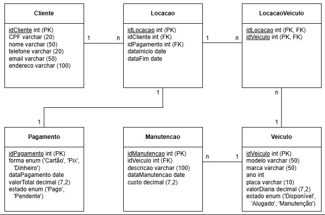

# 🚗 Locadora de Veículos — Implementação de Banco de Dados

> Projeto de **Banco de Dados** — UNINTER  
> Curso: Análise e Desenvolvimento de Sistemas · 2025

---

## 📖 Sobre o Projeto

A partir de um **modelo lógico (relacional)** fornecido para uma Locadora de Veículos, foi realizada a implementação completa do banco de dados em MySQL — criação das tabelas, inserção de dados de exemplo e consultas SQL representativas das operações do negócio.

---

## 📐 Modelo Lógico



---

## 🗄️ Tabelas

| Tabela           | Chave Primária            | Descrição                                        |
| ---------------- | ------------------------- | ------------------------------------------------ |
| `Cliente`        | `idCliente`               | Clientes cadastrados na locadora                 |
| `Veiculo`        | `idVeiculo`               | Frota com modelo, marca, placa e valor de diária |
| `Pagamento`      | `idPagamento`             | Pagamentos com forma, valor e status             |
| `Manutencao`     | `idManutencao`            | Histórico de manutenções por veículo             |
| `Locacao`        | `idLocacao`               | Locações vinculadas a clientes e pagamentos      |
| `LocacaoVeiculo` | `idLocacao` + `idVeiculo` | Tabela associativa — N:N entre Locacao e Veiculo |

---

## 📜 Scripts SQL

Os scripts estão organizados na pasta [`sql/`](sql/) por tipo de instrução:

| Arquivo                | Tipo | Descrição                                                                   |
| ---------------------- | ---- | --------------------------------------------------------------------------- |
| [`ddl.md`](sql/ddl.md) | DDL  | Criação do banco de dados e de todas as tabelas com PKs e FKs               |
| [`dml.md`](sql/dml.md) | DML  | Inserção de 10 clientes, 10 veículos, 20 locações e demais dados de testes  |
| [`dql.md`](sql/dql.md) | DQL  | 4 consultas representativas das operações da locadora                       |

### 🔍 Consultas implementadas

| #   | Consulta                                            | Técnica utilizada                             |
| --- | --------------------------------------------------- | --------------------------------------------- |
| Q1  | Manutenções realizadas — descrição, data e custo    | `SELECT` simples                              |
| Q2  | Total arrecadado (apenas pagamentos pagos)          | `SUM` + `WHERE`                               |
| Q3  | Veículos mais locados em ordem decrescente          | `JOIN` + `COUNT` + `GROUP BY` + `ORDER BY`    |
| Q4  | Clientes com pagamentos pendentes e valores devidos | `JOIN` múltiplo + `SUM` + `GROUP BY` + filtro |

---

## 🚀 Como executar

**Pré-requisito:** MySQL instalado (testado via MySQL Workbench).

```sql
-- 1. Criar banco e tabelas
source sql/ddl.sql

-- 2. Popular com dados de exemplo
source sql/dml.sql

-- 3. Executar as consultas
-- Abrir sql/dql.md e executar cada consulta individualmente
```

---

## 🧠 Conceitos explorados

Este projeto documenta os seguintes conceitos de banco de dados e SQL na pasta [`concepts/`](concepts/):

| Conceito                                                 | Descrição resumida                                                           |
| -------------------------------------------------------- | ---------------------------------------------------------------------------- |
| [Logical Model to SQL](concepts/logical-model-to-sql.md) | Processo de conversão do modelo relacional em código DDL executável          |
| [DDL, DML and DQL](concepts/ddl-dml-dql.md)              | As três sublinguagens do SQL e como o projeto está organizado por elas       |
| [Constraints](concepts/constraints.md)                   | Restrições de integridade: NOT NULL, PRIMARY KEY, FOREIGN KEY e ENUM         |
| [JOIN](concepts/join.md)                                 | Combinação de tabelas por chaves estrangeiras para consultas entre entidades |
| [Aggregate Functions](concepts/aggregate-functions.md)   | SUM, COUNT, GROUP BY e ORDER BY para totais, contagens e ordenação           |

_Os arquivos de conceito contêm explicações detalhadas e exemplos extraídos diretamente dos scripts SQL._

>[!NOTE]
>O uso de tabelas associativas como a LocacaoVeiculo permite que uma única locação contenha vários veículos, respeitando a regra de negócio N:N.

---

## 👩‍💻 Autora

**Giselle Pegado**  
Análise e Desenvolvimento de Sistemas — UNINTER · 2025
